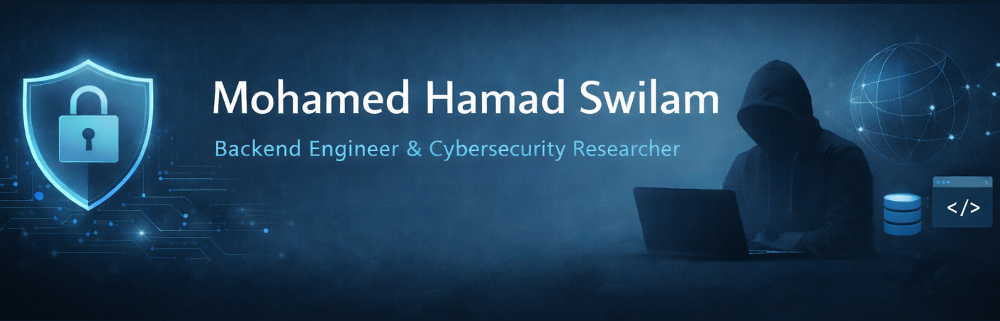

  

<h1 align="center">Hi 👋, I'm Mohamed Hamad Swilam</h1>
<h3 align="center">Backend Engineer | Security-Focused Developer</h3>

  
  &nbsp;&nbsp;
  
  &nbsp;&nbsp;
  
  &nbsp;&nbsp;
  
  &nbsp;&nbsp;
  
   
<a href="YourCV.pdf" download ">
    Download My CV
</a>

---

# 👨‍💻 About Me
Backend-focused engineer specializing in building secure, scalable, and high-performance server-side systems.  
Strong expertise in RESTful API design, authentication & authorization, database architecture, and security best practices.  
Experienced in penetration testing, vulnerability discovery, and developing production-ready backend systems.  
Familiar with frontend technologies for seamless collaboration when needed.

- 🧠 Backend & Full-Stack Developer specializing in **Node.js(NestJs, ExpressJs), and React(Next.js)**  
- 🔐 Strong background in API Security, web exploitation, and secure development practices  
- 🛡️ Junior Pentester with **30+ discovered vulnerabilities**  
- 🏆 CTF Player & Challenge Creator (Farm CTF)  
- 🖥️ ECPC problem-solving background  
- 🚀 Co-founder of **DeverCrowd**  

---

# 🛠️ Tech Stack

### 🔧 Backend & Development

### 🧩 Frontend Development

### 🛡️ Cybersecurity

 

### 🧰 Tools

### 🧪 Scripting & Languages

---

# 🏗️ Projects

  - **Overview:** Developed a startup portfolio web application to showcase the company’s vision, services, and projects, providing a professional online presence with a fully controlled admin dashboard.  
  - **Key Features:** Admin authentication system, content management dashboard, dynamic control of website sections, services and projects management, blog/news management, contact messages management, and rolebased access.  
  - **Technology:** Node.js, Express.js, MongoDB, Mongoose, RESTful APIs, JWT Authentication, React, NextJS, HTML5, CSS3, Tailwind, JavaScript.
##

- **Overview:** Developed a secure email client that integrates cybersecurity scanning to detect threats and protect emails in real-time, with an admin dashboard for monitoring and management.  
- **Key Features:** Secure login, email sending/receiving, phishing and spam detection, malicious link and attachment scanning, AI email analysis, threat reports, and dashboard analytics.  
- **Technology:** Node.js, Nest.js, MySQL, REST APIs, JWT, Gmail API, Outlook API, IMAP/SMTP, ChatGPT API, VirusTotal API, React, Next.js, Tailwind CSS, JavaScript.  

---

# 🏆 Cybersecurity Achievements
- Listed in **Bug Bounty Hall of Fames** *(ClassDojo, Daimler Truck, ION Group, etc.)*  
- 30+ vulnerabilities reported with high-quality POCs  
- Designed and hosted CTF challenges  
- Experienced in recon automation, payload crafting, impact analysis  

---

# 🎓 Education & Certifications
- **B.Sc. Computer Science (2022–2026)**  
- **CompTIA**  
  - Linux+  
  - Network+  
  - Security+ (Awareness)  
- **eLearnSecurity**  
  - eJPT  
  - eWAPT  
  - eWAPTX *(in progress)*

---

# 📊 GitHub Stats

---

> ⚡ *From secure systems to exploited systems — I build it, break it, and secure it again.*
